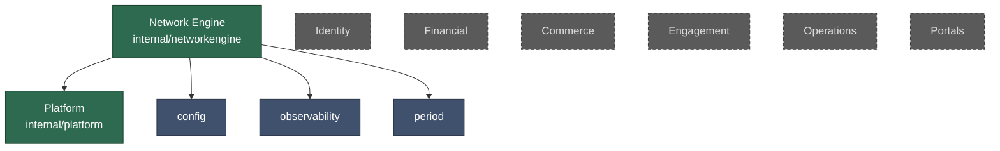
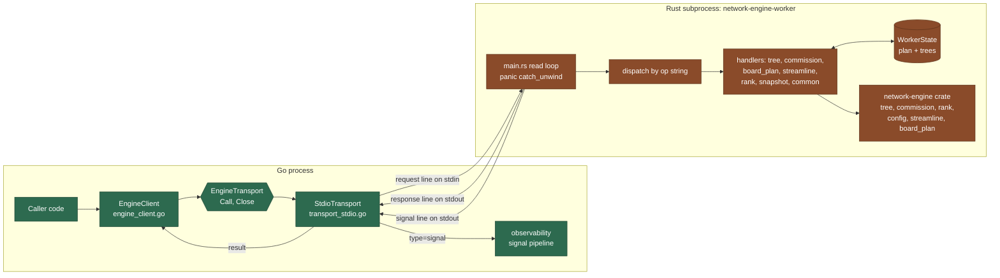
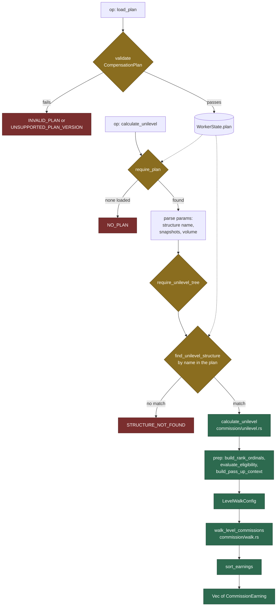
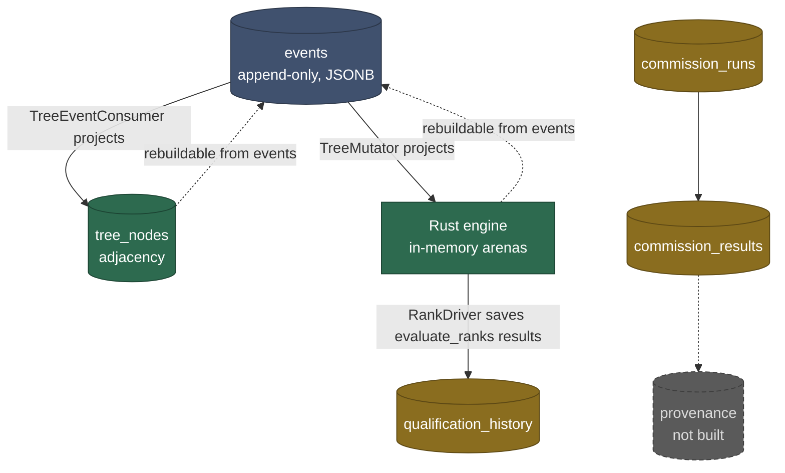

# 000: Architecture Overview

> **Status: current.** Three of the four diagrams below show shipped code
> only. The context wiring diagram shows what is wired today and marks what is
> not. For the target decomposition the system is built toward, read
> [001](001-bounded-contexts.md), which carries its own status banner.

This document is the map. It shows how the pieces fit together so you can find
your way into the rest of the folder. Every other document here explains one
decision in depth. This one explains none of them, it just shows where they sit.

Read this first if you are new. Then follow the links.

## Context Wiring Today

MLMForge is a modular monolith. Eight bounded contexts live under `internal/`,
but only two have implementations. The rest are interface and type declarations
waiting to be built.

Green has an implementation. Blue is a support package, not a bounded context.
Grey and dashed means the package exists and declares interfaces and types, but
no method bodies. Nothing imports the grey packages yet.

The one real cross-context edge is `TreeEventConsumer` in
`tree_consumer.go`, which reads `platform.Event`. There is no event bus. Domain
events are declared as structs and nothing emits or consumes them.

| Read next | For |
|-----------|-----|
| [001](001-bounded-contexts.md) | Why these eight contexts, and the dependency graph they are built toward |
| [002](002-context-boundaries.md) | Why a context cannot reach into another one |
| [004](004-interface-contracts.md) | Where interfaces live and how extraction is meant to work |

## The Go to Rust Seam

Commission math runs in Rust. Everything else runs in Go. The two talk over
NDJSON on a subprocess pipe. Go consumers never see Rust.

`EngineTransport` has two methods, `Call` and `Close`. `StdioTransport` is the
only production implementation. Tests use an in-package mock, so no Rust
binary is needed to test a Go consumer. A gRPC transport can implement the same interface later
without touching any consumer.

Responses and log signals share one stdout stream. The Go reader routes each
line by whether it carries `"type": "signal"`.

| Read next | For |
|-----------|-----|
| [003](003-network-engine-design.md) | Why Rust, why CV-only volume, why position-indexed trees |
| [019](019-ndjson-protocol.md) | The envelope, all 42 error codes, panic recovery, cancellation |
| [023](023-snapshot-persistence.md) | How `WorkerState` is snapshotted and restored |

## A Commission Calculation

Every commission op follows the same shape. The plan is loaded once and
validated at that door. Calculation requests carry data, never config.

Unilevel is the example. Matrix, stairstep, generation, and streamline follow
the same path into `walk.rs`. Binary pairs leg volume instead of walking
levels, so it stays standalone. Board plan calculates over cycle events.

There are seven commission ops, one per plan type.

| Read next | For |
|-----------|-----|
| [017](017-commission-calculation-architecture.md) | Snapshot versus rules, flat output, the prep and walk split |
| [022](022-shared-commission-walk.md) | What lives in `walk.rs` and why there is no calculator trait |
| [028](028-commission-config-from-validated-state.md) | Why config comes from state and never from the request |
| [018](018-config-pipeline.md) | The Go-side validation that runs before the plan ever reaches Rust |

## Where Data Lives

Two persistence models coexist on purpose. Tree topology is an event
projection. Commission data is primary data.

Every node is state. Blue is the source of truth for what it feeds. Green is
derived and can be rebuilt from the blue. Yellow is primary data that nothing
can rebuild. Grey and dashed is not built.

The split exists because of retention, and the retention it guards against is
not built yet. ADR-003 makes Compact the default mode, which purges raw events
after a ninety day window. Nothing implements it. `PostgresEventStore` has no
purge, and no migration enforces a window, so no event is deleted today.
HEU-19 tracks the work and is unstarted.

The split is defensive on purpose. Commission records are kept for years. Once
retention does land, provenance in the event stream would put a regulatory
requirement one config toggle away from being violated. Deciding that now costs
nothing. Discovering it after the purge ships costs the records.

Every table lives in the `public` schema. `DEVELOPMENT.md` assigns per-context
schemas, but no migration creates one.

| Read next | For |
|-----------|-----|
| [016](016-eventstore-design.md) | The unified store, stream naming, optimistic concurrency |
| [027](027-provenance-as-primary-data.md) | Why commission data is the documented exception to the projection rule |
| [029](029-commission-provenance-on-the-wire.md) | What the engine will emit once provenance lands |

## Where to Go From Here

[INDEX.md](INDEX.md) lists all thirty documents with a status column. The
compensation plan documents, 008 through 015, describe configurable options per
plan type and are best read when you need one of them.
