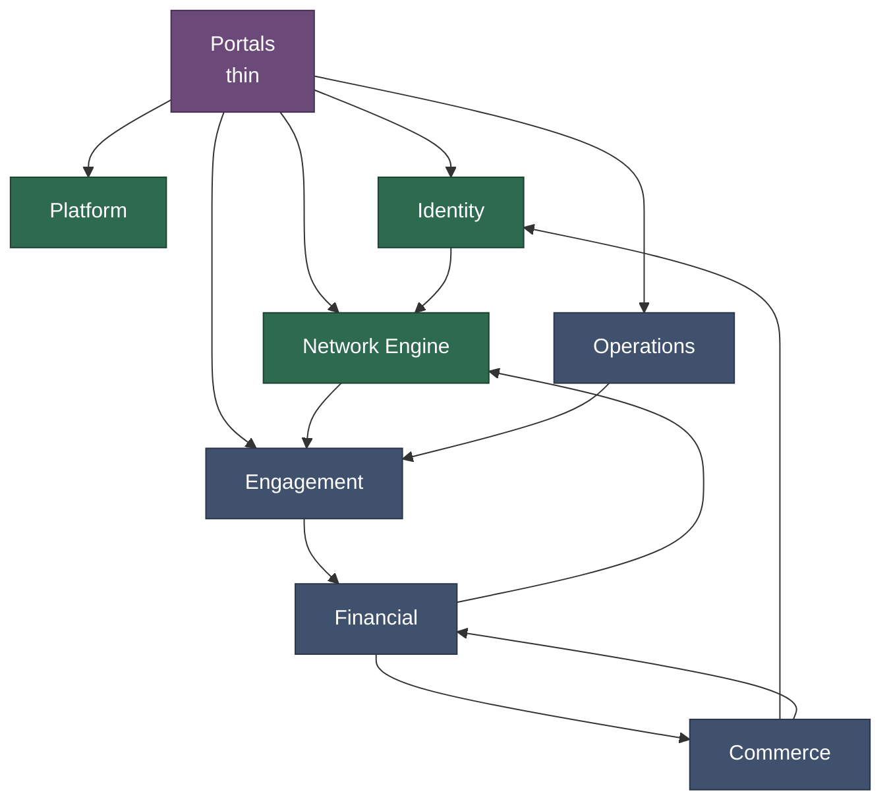

# 001: Bounded Contexts

> **Status: design intent, partly built.** The eight packages exist under
> `internal/`, but only Platform and Network Engine have implementations.
> Identity, Financial, Commerce, Engagement, and Operations hold interface and
> type declarations with no method bodies. Portals is a package comment.
> Per-context PostgreSQL schemas were never created. Every table in
> `migrations/` lands in `public`. Read the context table as the target
> decomposition, not as a description of shipped code.
> [000](000-architecture-overview.md) diagrams what is actually wired today.

## The Problem

The legacy system had 30 domain spaces across 2,273 files. Billing logic reached into user records. Order processing mutated commission tables directly. Reports joined every table in the database. Changing one area broke another. Nothing could be understood in isolation.

## The Decision

The system is divided into 8 bounded contexts. Each one owns a distinct slice of the business domain.

| Context | Language | What It Owns |
|---------|----------|-------------|
| **Platform** | Go | Configuration, audit logging, event persistence, job scheduling, sessions |
| **Identity** | Go | Users, addresses, status lifecycle, authentication |
| **Network Engine** | Rust | Tree structures, volume attribution, rank qualification, commission calculation |
| **Financial** | Go | Payment processing, wallet management, invoicing |
| **Commerce** | Go | Product catalog, autoship subscriptions, order events |
| **Engagement** | Go | Messaging, template token resolution, blacklist enforcement |
| **Operations** | Go | Customer service ticketing, cross-cutting reports, CMS content |
| **Portals** | Go | Admin panel and distributor back office (pure API consumer) |

Each context has its own Go package (`internal/{context}/`), its own PostgreSQL schema, and its own interfaces. No context reads or writes another context's data directly.

## Why These 8

**Why not fewer?** We considered merging Financial into Commerce. Both deal with money. But their concerns are different. Financial handles payment gateways, reconciliation, and disbursement. Commerce handles product catalogs, order lifecycle, and autoship. Merging them would recreate the coupling problems from the legacy system.

**Why not more?** We considered splitting Network Engine into separate contexts for trees, ranks, and commissions. But these three responsibilities are deeply intertwined. Commission calculation walks trees and checks ranks at every step. Splitting them would create a chatty interface between pieces that need to operate as a unit.

**Why is Portals separate?** Portals has no business logic. It composes interfaces from other contexts into API responses. This enforces the rule that the UI layer never contains domain logic. Any company can replace Portals without touching business code.

## Dependency Graph

The contexts form a layered dependency structure. The diagram shows the
principal edges. It is not the full graph. The counts in the table below
include edges that would clutter the picture, which is why Portals shows five
arrows here and depends on seven contexts in the table.

Every context also depends on Platform. Only the Portals arrow is drawn, so
the rest stays readable.

The two count columns below do not reconcile. "Depended Upon By" sums to 31
and "Depends On" sums to 33, and in a directed graph those totals have to
match. They came from the legacy analysis and were never rechecked. Read them
as rough weight, not as an edge count.

| Context | Depended Upon By | Depends On | Role |
|---------|-----------------|------------|------|
| Identity | 7 | 2 | Core provider |
| Platform | 7 | 1 | Infrastructure |
| Network Engine | 5 | 3 | Core provider |
| Financial | 4 | 4 | Bilateral |
| Commerce | 3 | 5 | Mixed |
| Engagement | 3 | 5 | Mixed |
| Operations | 2 | 6 | Heavy consumer |
| Portals | 0 | 7 | Pure consumer |

Identity, Platform, and Network Engine form the foundation. Everything else depends on them. This drives the build order: foundation first, then business contexts, then presentation.

## What This Enables

- **Independent development.** Each context can be worked on separately. The interfaces are the contract.
- **Independent deployment.** The monolith runs as a single binary. Any context can be extracted to its own service by swapping in-process calls for gRPC or NATS. Same code, different wiring.
- **Schema isolation.** No cross-schema joins. This adds friction but prevents the coupling that made the legacy system unmaintainable.
- **Interface discipline.** Getting the interfaces right is critical. They are the hardest thing to change later.
