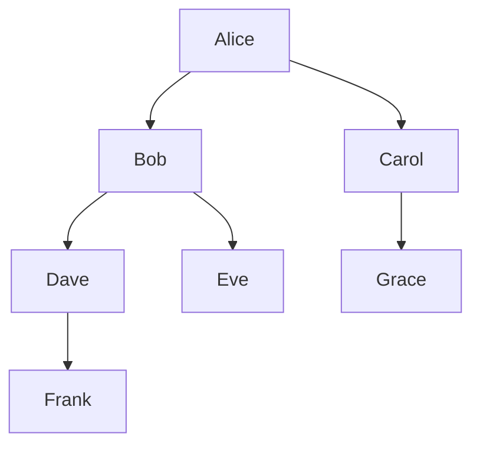
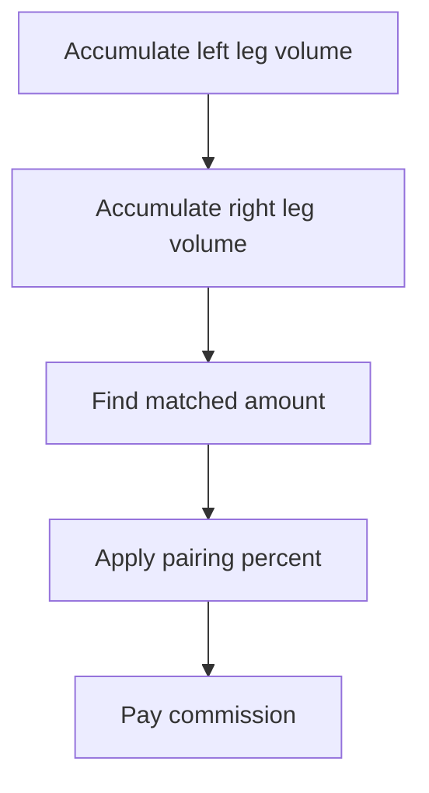
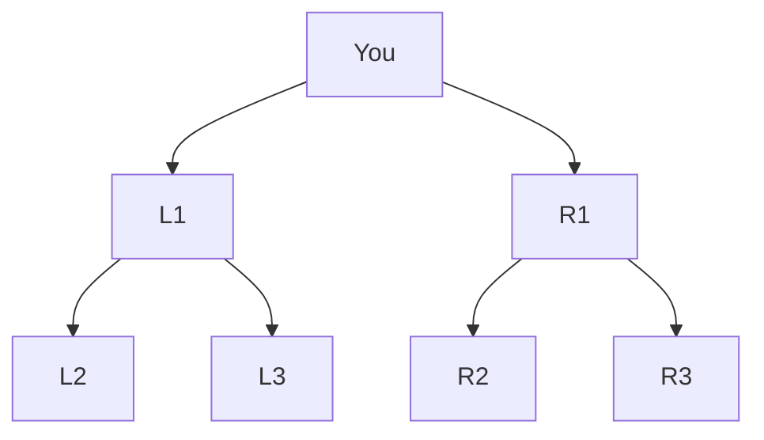

# Binary

The binary structure gives every distributor exactly two positions: a left side and a right side. Commissions are based on how well those two sides match. This guide explains how the structure works, what options you can configure, and how volume flows across periods.

---

## What It Is

In a binary tree, each distributor has two spots below them. One on the left and one on the right. New recruits fill one of those two spots. When both spots are full, the next recruit goes deeper, below someone who still has an open position.

The tree grows deep, not wide. A distributor's entire left-side organization is called their "left leg." Everything on the right is their "right leg." There is no limit to how deep either leg can grow.

The structure rewards teamwork. When your sponsor recruits someone new and their left and right spots are already taken, that recruit spills down into your tree. This is called spillover. You did not recruit that person, but they show up in your organization and their volume counts toward your leg totals.

The diagram below shows a simple binary tree. Alice is at the top. Her left leg goes three levels deep. Her right leg goes two levels deep.

Bob, Dave, and Frank make up Alice's left leg. Carol and Grace make up her right leg. Eve is also in Alice's left leg, under Bob. All the volume from every person in a leg rolls up to form that leg's total.

---

## How Earning Works

Volume accumulates in each leg separately over the commission period. At the end of the period, the system compares the two legs and calculates a commission based on how much volume they share in common.

The leg with less volume is the "weaker leg." The weaker leg determines how much volume is matched. You cannot earn on volume that only exists on one side. Both legs must contribute.

The formula is:

> Matched volume x pairing percent x volume-to-dollar multiplier = commission

If your left leg has 3,000 volume and your right leg has 5,000 volume, the matched volume is 3,000. With a 10% pairing rate and a 1.0 multiplier, you earn 3,000 x 10% x 1.0 = $300.

See [Fundamentals](fundamentals.md) for eligibility and caps.

The diagram below shows the commission flow step by step.

The matched amount is always the smaller of the two legs. Everything above that on the stronger leg is excess. What happens to that excess depends on your volume-after-payout setting, covered in the next section.

---

## Options You Have

### Pairing percent

The pairing percent is the core earning rate. It controls what percentage of matched volume is paid as commission.

| Choice | What it means |
|--------|--------------|
| 10% | For every 100 matched volume, the distributor earns $10 (assuming a 1.0 multiplier). |
| 12% | For every 100 matched volume, the distributor earns $12. |

Most companies set this between 10% and 12%. Higher rates attract distributors but cost the company more. Lower rates are more sustainable but less exciting.

**Most common:** 10%.

### Calculation mode

The calculation mode controls how the system turns leg volumes into a payable amount. There are two choices.

| Choice | Formula | What it means |
|--------|---------|--------------|
| Weaker leg | matched volume x percent | Simple. Pay on the full weaker leg. A 3,000/5,000 split pays on 3,000. |
| Volume ratio | matched volume x percent x (weaker / stronger) | Penalizes imbalance. A 3,000/5,000 split pays on 3,000 x 0.6 = 1,800. |

Weaker leg mode is straightforward. The smaller leg is the payable amount. That is it.

Volume ratio mode adds a balance penalty. It multiplies the payable amount by the ratio of the weaker leg to the stronger leg. A perfectly balanced tree (50/50 split) earns the full rate because the ratio is 1.0. A lopsided tree (90/10 split) earns only about 11% of what weaker leg mode would. This pushes distributors to build both sides evenly.

**Most common:** Weaker leg.

### What happens to volume after payout

This is the most important choice in a binary plan. It determines what happens to each leg's volume after commissions are paid.

| Choice | What happens | What it means |
|--------|-------------|--------------|
| Full flush | Both legs reset to zero | Start fresh every period. No momentum carries over. Rare in modern plans because it discourages long-term building. |
| Net off | Subtract the matched amount from both legs | For eligible distributors, the weaker leg becomes zero and the stronger keeps its excess. Same as carry forward in most cases. The difference: when a distributor is ineligible, net off preserves both legs as-is (nothing was matched). Carry forward always zeroes the weaker leg. |
| Carry forward | Weaker leg zeroes out, stronger leg keeps the unmatched excess | The stronger leg accumulates across periods. Creates momentum. The industry standard. Even ineligible distributors lose their weaker leg volume. |

With carry forward, a distributor who builds one strong leg can let volume pile up on that side. When the weaker leg finally gets volume, there is already a large balance waiting to match against. This is the "power leg" strategy and it is why most binary companies use carry forward.

**Most common:** Carry forward.

### Carry-forward cap

The carry-forward cap sets the maximum volume that can carry into the next period on the stronger leg.

| Choice | What it means |
|--------|--------------|
| No cap | The stronger leg can accumulate forever. A distributor who builds one side huge can coast as trickle volume on the other side matches against the stored excess. |
| Capped (e.g., 100,000) | Once the stronger leg hits the cap, any excess beyond that is lost. Prevents infinite accumulation. |

Without a cap, top builders can generate commissions indefinitely with minimal new effort on one side. A cap keeps things moving by requiring ongoing activity.

**Most common:** Capped, with the specific number varying by company.

### Per-period cap

The per-period cap is the maximum commission one distributor can earn in a single period.

| Choice | What it means |
|--------|--------------|
| No cap | No limit on individual earnings per period. |
| Capped (e.g., $5,000) | Even if the math says a distributor earned $8,000, they receive $5,000. The excess is not paid or carried. |

This protects company margins. Without it, a top earner with massive legs could consume a disproportionate share of the commission budget.

**Most common:** Capped.

### Multi-position income centers

One person can own multiple positions in the binary tree. Each position is an independent income center with its own left leg and right leg. The tree does not know about ownership. It just sees positions. A separate mapping tells the system which person owns which positions.

Each position earns its own pairing bonus independently based on the volume in its two legs. This is useful for power builders who want to earn from multiple spots in the tree.

There are two ways to cap earnings when someone owns multiple positions.

| Cap type | How it works |
|----------|-------------|
| Per-position cap | Each income center is capped independently. Position A has its own cap. Position B has its own cap. They do not affect each other. |
| Aggregate cap | The owner's total across all positions is capped. If the cap is $5,000 and two positions earn $3,000 each ($6,000 total), the system scales the total down to $5,000. Each position's payout is reduced proportionally. Position A gets $2,500 and Position B gets $2,500. This is called pro-rata scaling. It preserves the relative contribution of each position. |

**Most common:** Aggregate cap.

---

## Worked Example

This example uses a 7-node tree across two commission periods. The pairing percent is 10%, the volume-to-dollar multiplier is 1.0, and the volume-after-payout mode is carry forward.

The tree below shows the structure. "You" is the root. L1, L2, and L3 are in your left leg. R1, R2, and R3 are in your right leg.

L2 and L3 are under L1. R2 and R3 are under R1. All six contribute volume to your legs.

### Period 1

| Node | Volume | Leg |
|------|--------|-----|
| L2 | 100 | Left |
| L3 | 100 | Left |
| R2 | 300 | Right |
| R3 | 200 | Right |
| **Left total** | **200** | |
| **Right total** | **500** | |

Matched volume: 200 (the weaker leg).

> 200 x 10% x 1.0 = **$20.00**

After payout with carry forward: the weaker leg (left) zeroes out. The matched amount is subtracted from the stronger leg (right). Right had 500, minus 200 matched, leaves 300. That 300 carries into period 2.

### Period 2

New volume arrives.

| Source | Volume | Leg |
|--------|--------|-----|
| Carried from period 1 | 300 | Right |
| New left leg volume | 400 | Left |
| New right leg volume | 100 | Right |
| **Left total** | **400** | |
| **Right total** | **400** | |

The carried 300 plus the new 100 gives the right leg 400. The left leg has 400 from new activity. They match perfectly.

Matched volume: 400.

> 400 x 10% x 1.0 = **$40.00**

### The power of carry forward

| Period | Left | Right | Matched | Commission |
|--------|------|-------|---------|-----------|
| 1 | 200 | 500 | 200 | $20.00 |
| 2 | 400 | 400 | 400 | $40.00 |

Period 2 earned double. The carried volume from the right leg helped balance things out. Without carry forward (full flush), the right leg would have been only 100 in period 2. The matched amount would have been 100 instead of 400, and the commission would have been $10 instead of $40.

Carry forward turns prior success into future momentum.

---

## What It Doesn't Do

**CycleStep mode is not yet available.** CycleStep is a legacy calculation method where fixed dollar amounts are paid at specific volume thresholds instead of percentages. The configuration types exist, but the calculation engine does not support it yet.

**No unlimited width.** Binary means exactly two positions. If you need unlimited frontline width, use a unilevel structure instead.

**Placement decisions are not part of the commission engine.** The commission engine calculates payouts based on where people already are in the tree. Deciding which leg a new recruit goes into (left or right, balanced or power leg) is handled by the business rules layer before the recruit reaches the tree.

**Binary trees do not support compression.** In a unilevel, compression can skip over inactive distributors so the people above them still earn on deeper levels. Binary does not work this way. Every position in the tree is a structural node. Inactive distributors stay in place. Their volume (or lack of it) affects the leg totals as-is.
