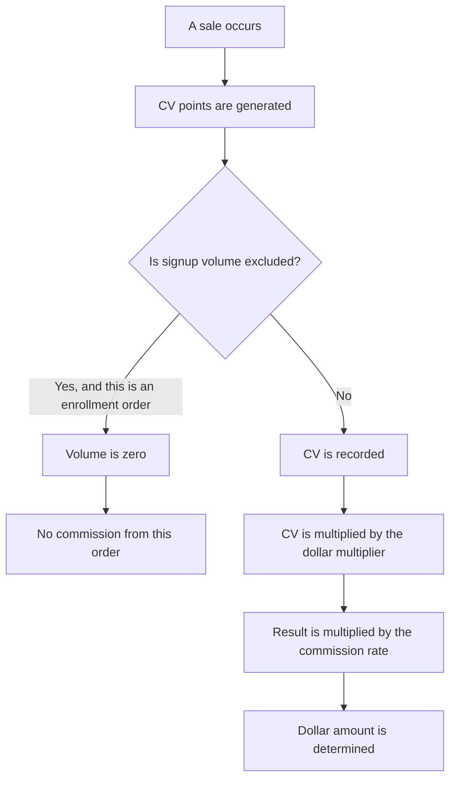
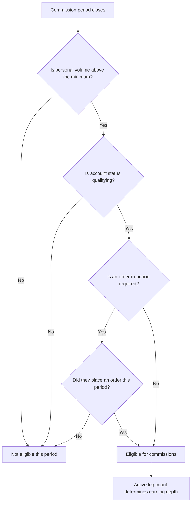
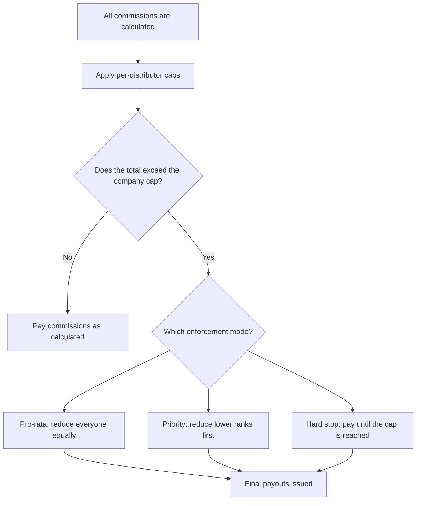

# Fundamentals

No matter which compensation structure you choose, three concepts show up everywhere: volume, eligibility, and caps. This guide explains all three. Read it before diving into any specific structure guide.

---

## Volume

Every commission calculation starts with volume. Volume is a point value assigned to each product. It is not the retail price. A $100 product might carry 80 volume points. You set the volume value per product in your catalog.

There are three types of volume you need to know.

**Personal volume (PV)** is the total points a distributor generates from their own purchases in a given period. If a distributor buys two products worth 50 points each, their PV is 100.

**Group volume (GV)** is the total volume from a distributor plus everyone in their downline organization. If a distributor has 100 PV and their team has 5,000 PV combined, their GV is 5,100. GV is what most rank qualifications look at.

**Commissionable volume (CV)** is the number that actually feeds into the commission math. In most plans, CV equals PV. But two settings can change that.

First, **signup volume**. Some plans exclude volume from enrollment purchases. The idea is that the enrollment fee is administrative, not a real product sale. When this setting is on, the new distributor joins the tree but their signup order generates zero volume. No commissions fire from it.

Second, **deducting qualifying volume**. Some plans subtract the volume a distributor used to qualify for their rank. This prevents double-counting. If a distributor needed 100 PV to hit their rank, that 100 PV would not also generate commissions for their upline. Most plans leave this off. It is rare.

### How volume becomes dollars

Volume points do not pay bills. They need to become currency. That is where the volume-to-dollar multiplier comes in. The formula is straightforward:

> CV x multiplier x rate = dollar amount

Say a distributor has 200 CV. The multiplier is 0.50 (meaning each point is worth fifty cents). The commission rate for their level is 10%. The math is 200 x 0.50 x 0.10 = $10.00.

The diagram below shows this flow from start to finish.

The key takeaway: volume is not money. It is a scoring system that gives you control over how much commission each product generates, independent of its retail price. Two products can cost the same but carry different volume if one is more profitable than the other.

---

## Eligibility

Earning commissions is not automatic. A distributor must meet certain conditions each period. These conditions are separate from rank. A distributor can hold a high rank and still be ineligible if they fail any of these checks.

**Minimum personal volume.** Most plans set a PV floor. If the threshold is 100 PV and a distributor only has 80 PV, they earn nothing that period. This keeps the network active. People who are not buying or selling do not get paid.

**Active status.** Every distributor account has a status. Only certain statuses qualify for commissions. Typically "active" always qualifies. Some plans also allow "grace" status to earn. Statuses like "suspended" or "terminated" never qualify.

**Order-in-period requirement.** Some plans go beyond the PV minimum and require at least one purchase in the current period. Even if a distributor has leftover volume from a large prior order, they need to place a new order to stay eligible. This encourages consistent activity.

**Active leg tiers.** This one rewards wide building. An "active leg" is a direct frontline recruit who meets the PV minimum and status requirements. The more active legs a distributor has, the deeper they can earn commissions in their downline. For example, 2 active legs might let a distributor earn 3 levels deep. 4 active legs might unlock 5 levels. 7 active legs might unlock unlimited depth. This pushes distributors to recruit and support multiple people instead of stacking everyone under one star performer.

The diagram below shows how these checks work together.

Here is the important part: when a distributor is ineligible, they do not block the chain. Their volume still flows upward through them to their upline. The people above them still benefit from the group volume. The ineligible distributor just does not personally earn. Think of it like a pipe. The water still flows through. The pipe just does not keep any for itself.

---

## Caps

Caps protect the company from paying out more than it can afford. There are two types.

**Per-distributor per-period cap.** This is a ceiling on what any single person can earn in one commission period. If the cap is $50,000 and the math says a distributor earned $62,000, they get $50,000. The excess is not carried forward. It is simply not paid. This prevents a single top earner from consuming a disproportionate share of the commission budget.

**Company payout cap.** This is the big one. It sets the maximum percentage of total commissionable sales the company pays out as commissions. The industry standard is 40-45%. If total commissionable sales for the period are $1,000,000 and the cap is 42%, the company will not pay more than $420,000 in total commissions. If the raw commission calculations add up to $480,000, something has to give.

What gives depends on the **cap enforcement mode** you choose. There are three options.

**Pro-rata** scales everyone down proportionally. If commissions need to shrink by 12%, every distributor's payout drops by 12%. A person who earned $1,000 gets $880. A person who earned $100 gets $88. It is the fairest approach. Everyone shares the reduction equally.

**Priority reduction** protects higher-ranked distributors. Lower ranks take the cut first. If that is not enough, the next rank up takes a cut, and so on. Top earners are the last to be reduced. This rewards achievement but can feel unfair to newer distributors.

**Hard stop** is first-come, first-served. The system processes commissions in order. Once the cap is reached, it stops paying. Whoever was processed first gets paid in full. Whoever was processed last might get nothing. This is the simplest to understand but the least predictable.

One more tool: **clawback**. When enabled, if a customer returns a product or a charge is reversed, the commissions that were paid on that order can be deducted from future payouts. The distributor does not write a check back. The system simply reduces their next commission. This protects the company from paying commissions on revenue it did not keep.

The diagram below shows how caps are applied after all commissions are calculated.

The company payout cap is your safety net. Without it, a generous compensation plan can pay out more than the company earns in margin. Set it during plan design and review it quarterly. If you are consistently hitting the cap, your rates may be too high or your volume-to-dollar multiplier needs adjustment.
