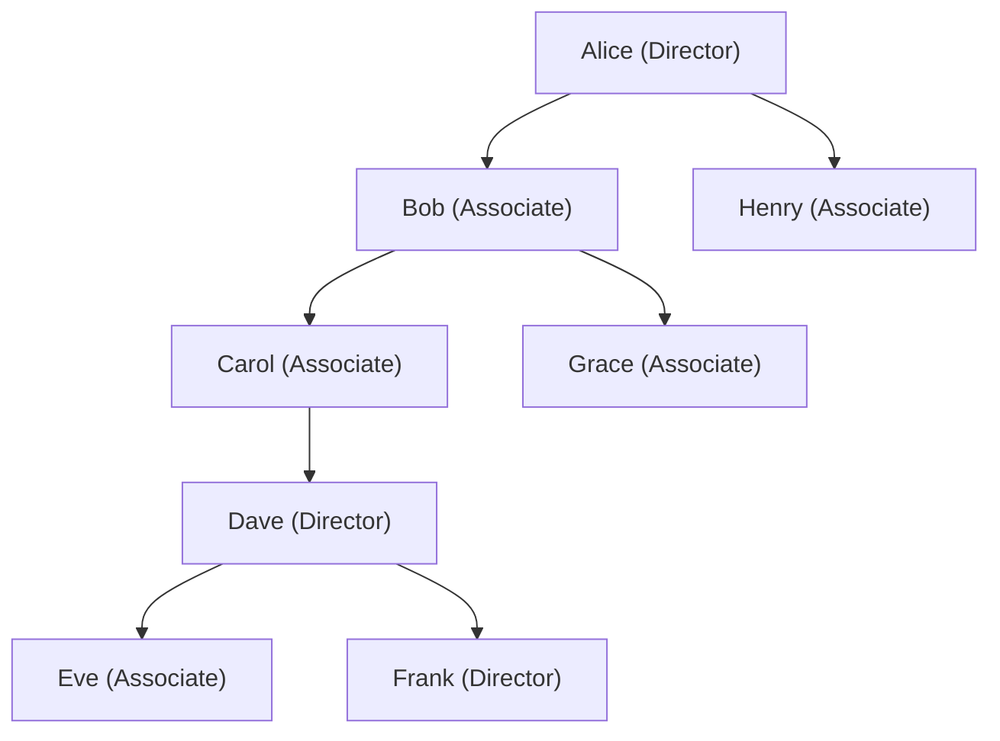

# Generation

Generation commissions pay on leadership depth, not tree depth. Where unilevel counts levels (1, 2, 3), generation counts rank boundaries. A new generation starts each time the walk encounters a leader at or above a qualifying rank.

There is no fixed earning depth. A distributor's earning potential grows as their leaders build leaders who build leaders.

---

## What It Is

The tree is the same unilevel tree. Same unlimited width, same unlimited depth. The difference is how commissions are calculated.

In a unilevel plan, the walk counts tree levels from the volume source upward. Level 1 is the source's direct upline. Level 2 is the next ancestor. Simple depth counting.

In a generation plan, the walk counts rank boundaries. It starts at the volume source and walks up the tree. Every time it hits a distributor at or above a boundary rank, that is a generation boundary. The distributors between boundaries form a generation group. Generation 1 is the first group. Generation 2 is the next. And so on.

From Eve's perspective, walking upward:
- **Dave** is a Director. First boundary. Generation 1.
- **Carol, Bob** are Associates. Not boundaries. Still in Alice's generation.
- **Alice** is a Director. Second boundary. Generation 2.

Dave earns a generation 1 commission on Eve's volume. Alice earns a generation 2 commission. The rates decrease by generation. Generation 1 might pay 10%. Generation 2 might pay 7%. Generation 3 might pay 5%.

---

## Boundary Modes

Two modes control what counts as a generation boundary.

### Threshold Rank

A fixed rank creates boundaries for everyone. If the boundary rank is "Director," then every Director in the upline creates a boundary for every earner. The generation structure looks the same from every perspective.

One walk per volume source serves all earners. Lower computational cost.

### Same Rank

Each earner's own rank determines what counts as a boundary. A Diamond earner only sees Diamond-and-above leaders as boundaries. A Gold earner sees Gold-and-above. A higher-ranked earner sees fewer boundaries. Fewer boundaries means larger generation groups and bigger payouts.

This rewards rank advancement aggressively. A Diamond sees the whole tree divided into fewer, larger generations than a Gold does. Moving from Gold to Diamond changes the earning structure.

The trade-off is computational cost. Each earner needs their own walk because their boundary set is different.

---

## Empty Generation Handling

When two boundary-rank leaders are adjacent in the upline (no non-boundary distributors between them), there is an "empty" generation with zero volume.

| Setting | Behavior |
|---------|----------|
| **Consumes number** (true) | The empty generation takes a generation number. Deeper volumes shift to lower-paying tiers. Penalizes top-heavy structures. |
| **Skips** (false) | The empty generation does not advance the counter. Deeper volumes stay at higher-paying tiers. Rewards deep building. |

Default is false. Companies can choose based on whether they want to encourage vertical leader stacking or spread.

---

## Ineligible Boundary Behavior

When a boundary-rank distributor is ineligible (inactive, insufficient PV), two behaviors are configurable.

### Ineligible Creates Boundary (default: true)

Rank defines structure. Eligibility defines payout. An inactive Director still separates Generation 1 from Generation 2. They just do not earn on the volume.

This is the default. The generation structure stays stable regardless of who is active this period. Distributors can predict their generation assignments.

### Ineligible Does Not Create Boundary (false)

Ineligible boundary-rank distributors become invisible to the generation walk. They do not create boundaries and they do not earn. The generation structure shifts based on who is active.

When this mode is combined with "empty generation consumes number," an ineligible boundary-rank distributor consumes a generation number without earning. The generation counter advances past them.

---

## Combined Level and Generation

Many generation plans pay both level commissions and generation commissions on the same volume.

Level commissions work exactly like unilevel. They reward the immediate upline based on tree depth. The rate table, broad commission percent, and compression all apply normally.

Generation commissions reward the leadership pipeline. They use a separate rate table indexed by generation number. No broad commission percent. Generation rates are the effective percentage.

When both are enabled, both calculations run on the same volume events. They produce separate earnings that are combined in the result.

| | Level commissions | Generation commissions |
|---|---|---|
| Counter | Tree depth (1, 2, 3...) | Rank boundaries (gen 1, 2, 3...) |
| Rate lookup | `rate_table[rank][level]` | `generation_rates[generation]` |
| Formula | `cv * broad_pct * multiplier * rate` | `cv * multiplier * rate` |

---

## Configuration Reference

| Option | Type | Default | Description |
|--------|------|---------|-------------|
| max_generations | integer | — | Maximum number of generations to pay. |
| generation_rates | map (gen number to rate) | — | Commission percentage per generation. |
| boundary_mode | "threshold_rank" or "same_rank" | — | How boundaries are determined. |
| boundary_rank | rank name | — | Rank that creates boundaries (ThresholdRank mode). Ignored in SameRank mode. |
| empty_generation_consumes_number | boolean | false | Whether empty generations advance the counter. |
| volume_to_dollar_multiplier | float or null | plan-level | CV to currency conversion. Null uses plan default. |
| ineligible_creates_boundary | boolean | true | Whether ineligible boundary-rank distributors still define structure. |
| level_commissions_enabled | boolean | false | Whether standard level commissions also apply. |
| level_commission | object or null | null | Level commission config (max_depth, rate_table, broad_pct). Required when level_commissions_enabled is true. |
