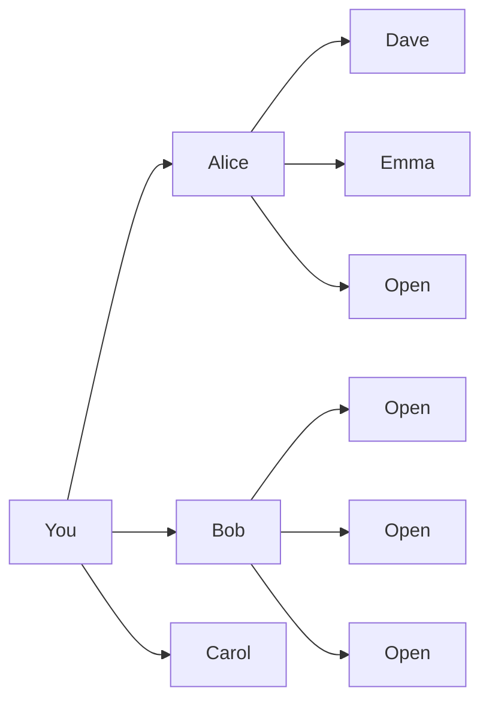
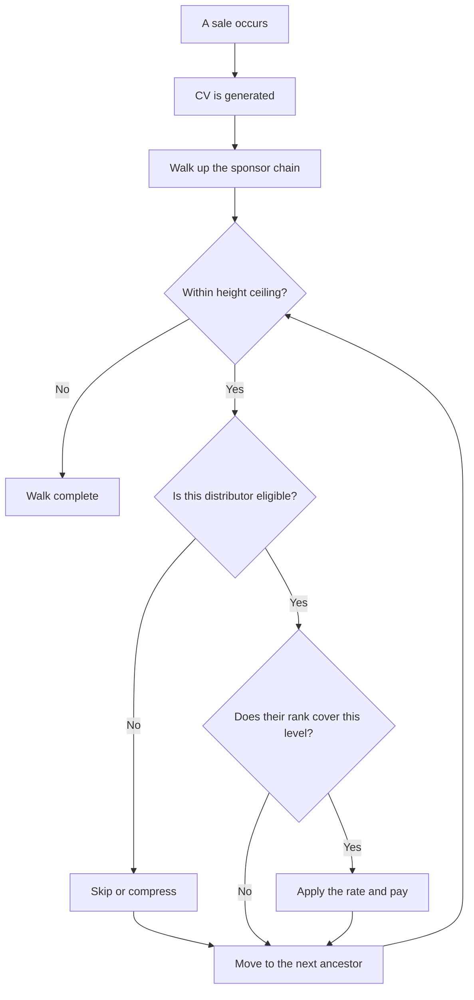
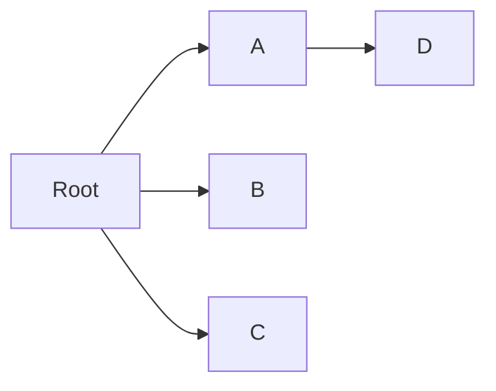

# Matrix

Matrix is a constrained version of unilevel. It limits both width and depth. When a position is full, new recruits spill over to open spots further down the tree. If you want a structure where your upline's activity directly fills your organization, this is it.

---

## What It Is

Every distributor has a fixed number of spots below them. That number is the matrix width. If the width is 3, each distributor can hold at most 3 direct recruits. Once those 3 spots are full, the next recruit placed under that distributor spills down to the first open position in the tree below them.

The matrix also has a fixed depth. This is the height. No commissions are paid beyond this level. A 3x7 matrix means 3 wide and 7 deep. A 5x5 means 5 wide and 5 deep. A 2x12 means 2 wide and 12 deep.

The total number of positions in a full matrix is width raised to the power of height. A 3x7 matrix has 3^7 = 2,187 positions. A 2x12 has 4,096. These are theoretical maximums. Most trees never fill completely.

Spillover is the defining feature. When you recruit someone and your spots are full, the system places that recruit in an open position below one of your existing team members. That team member did not recruit anyone. But they now have someone in their downline because of your work. Their tree grew because you were active.

Common configurations are 3x7, 5x5, and 2x12. Narrower matrices create more spillover. Wider matrices require more personal recruiting before spillover kicks in.

The diagram below shows a 3-wide, 2-deep matrix. Some positions are filled and some are still open.

You have three direct spots and all three are filled by Alice, Bob, and Carol. Alice has two of her three spots filled by Dave and Emma. She has one open. Bob has all three spots open. Carol's level is not shown, but she also has three open spots. The next recruit placed under you would spill down to one of these open positions.

---

## How Earning Works

Matrix uses the same level-based commission mechanism as unilevel. When someone generates volume, the system walks up the sponsor chain level by level. At each level, it checks whether the distributor is eligible and whether their rank covers that depth. If both are true, the distributor earns a commission.

The key difference is the height ceiling. In unilevel, depth is limited only by the plan's maximum commission depth setting. In matrix, depth is limited by the structure itself. The tree physically stops at the height limit. No positions exist beyond it. No commissions flow beyond it.

The other key difference is spillover. Your downline can grow without your direct recruits doing any recruiting at all. Your upline's work fills positions in your tree. Volume from those spillover recruits flows up through you, and you earn commissions on it just like any other downline volume.

See [Fundamentals](fundamentals.md) for how eligibility works.

The diagram below shows the commission walk with a height ceiling check.

The walk stops at the height ceiling regardless of rank or eligibility. Even if a Diamond could earn on 10 levels in a unilevel plan, a 7-deep matrix caps them at 7.

---

## Options You Have

### Width

**Choices:** Typically 2 to 5.

**What it means:** Narrower matrices fill faster. A width of 2 means each distributor only needs two direct recruits before spillover begins. This creates excitement. New members see their downlines grow quickly because their upline's recruits are filling positions below them.

Wider matrices require more personal recruiting before spillover kicks in. A width of 5 means five spots must fill before anyone spills. Less free help. More independence required.

**Most common:** 3.

### Height

**Choices:** Typically 5 to 12.

**What it means:** Deeper matrices have more earning potential. A 3x10 matrix has 59,049 theoretical positions. That is a lot of potential volume flowing upward. But deeper matrices are harder to fill. Most members will never see their tree extend close to the bottom.

Shallower matrices fill faster. Members see tangible progress sooner. But the total payout opportunity is smaller because there are fewer levels generating commissions.

**Most common:** 7.

### Spillover direction

When a position is full and a recruit needs to go somewhere, the system has to pick an open spot. There are two strategies.

**Breadth first.** Fill each level completely before moving to the next one. The system finds the first open position on the shallowest available level. This creates wide, balanced trees. It is the industry standard because it distributes spillover evenly across the team.

**Depth first.** Fill one branch all the way down before starting the next. The system follows the leftmost open path to the bottom. This creates deep, narrow paths. It is less common. It concentrates spillover into fewer people's organizations.

**Most common:** Breadth first.

### Compression

Same options as unilevel. Compression controls what happens when an inactive or low-rank distributor sits in the middle of the commission chain.

**No compression.** Ineligible distributors hold their level position. Commissions can leak through empty layers.

**Skip inactive.** The system jumps over ineligible distributors during the upline walk. The next eligible person earns at the skipped level.

**Skip below rank.** The system jumps over distributors who have not reached a certain rank. A higher bar than skip-inactive.

**Most common:** Skip inactive.

### Rate table

Same structure as unilevel. A grid of percentages where each rank has a row and each level has a column. Higher ranks earn at more levels and sometimes at higher rates. The rate table is how you express the financial value of advancement.

### Pruning

What happens when someone leaves the matrix? The person above them now has an empty spot, and the person below them is disconnected. Pruning handles this.

**Promote earliest.** The longest-tenured child of the departing distributor moves up to fill the gap automatically. Their children stay with them. It is simple and requires no manual work. The tree heals itself.

**Holding tank.** Orphaned nodes go to a holding area. An administrator manually decides where to re-place them in the matrix. This gives the company more control but requires ongoing attention.

**Most common:** Promote earliest.

---

## Worked Example

This example uses a 3x3 matrix (3 wide, 3 deep) with a 40% broad commission percent, a 1.0 volume-to-dollar multiplier, and breadth-first spillover.

The tree has 5 people. Root recruited A, B, and C. Root's three spots are full. Root then recruits D, but there is no room. D spills over to A's first open position.

The diagram below shows the tree after spillover.

Root recruited D, but D is in A's downline. A benefits from Root's recruiting. This is spillover in action.

D generates 100 CV. The rate table is:

| Rank | Level 1 | Level 2 | Level 3 |
|------|---------|---------|---------|
| Member | 5% | -- | -- |
| Silver | 5% | 5% | -- |
| Gold | 5% | 5% | 5% |

A is a Silver. Root is a Gold.

The system walks up from D.

| Level from sale | Distributor | Rank | Rate | Calculation | Earnings |
|-----------------|-------------|------|------|-------------|----------|
| Level 1 | A | Silver | 5% | 100 x 0.40 x 1.0 x 0.05 | $2.00 |
| Level 2 | Root | Gold | 5% | 100 x 0.40 x 1.0 x 0.05 | $2.00 |

A earns $2.00 at level 1 because D is directly below A in the matrix. Root earns $2.00 at level 2 because A is directly below Root. The height ceiling is 3, so the walk could continue one more level if there were an ancestor above Root.

The spillover payoff: Root recruited D, but A gets the level 1 commission from D's volume. A did not recruit anyone. Root's activity filled A's tree and A earns from it. Root still earns, just at level 2 instead of level 1.

---

## What It Doesn't Do

**No leg balancing.** Matrix does not compare left and right legs. There are no "legs" in the binary sense. That mechanic belongs to binary plans. Volume simply flows up level by level.

**No breakaway mechanics.** Groups do not detach when a distributor reaches a certain rank. That is how stairstep breakaway plans work. In matrix, your downline stays your downline regardless of rank.

**Positions are fixed.** Distributors do not automatically move up when someone above them leaves. The tree structure is rigid. The only exception is when pruning is configured to promote the earliest child into a vacated spot.

**Distributors do not control placement.** Spillover is handled by the system based on the configured direction (breadth first or depth first). A distributor cannot choose where their recruits land in the matrix. The system picks the next open position according to its rules.
