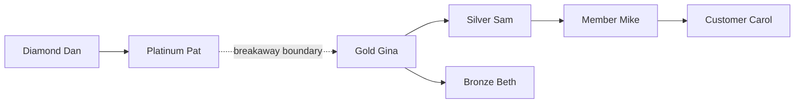
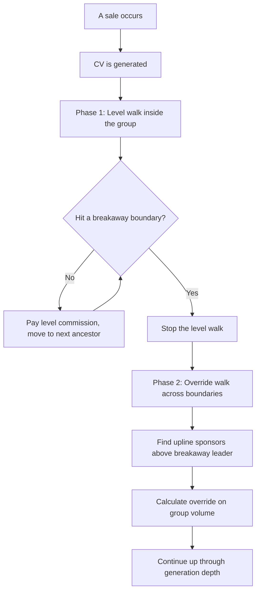
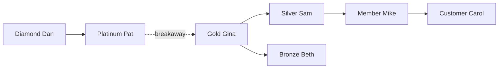

# Stairstep Breakaway

Stairstep breakaway is the most complex compensation structure in MLM. It starts like a unilevel plan but adds a second layer of commissions when distributors reach leadership ranks. That second layer is where the real earning power lives.

---

## What It Is

The structure starts familiar. A sponsor recruits people into their downline. Commissions flow upward, level by level, just like unilevel. The rate table determines who earns what at each depth. So far, nothing new.

The twist comes when a downline distributor reaches a threshold rank. When that happens, their group "breaks away" from their upline. The upline no longer earns level commissions on anyone in that group. Instead, the upline earns a different kind of commission called an override. The override is based on the breakaway leader's total group volume.

This creates a staircase effect. As leaders build other leaders, groups keep breaking away. Each breakaway creates a new commission boundary. The senior leader at the top earns overrides on each breakaway group below them. The more leaders they develop, the more override income they collect.

One thing to understand clearly: breakaway is a commission boundary, not a structural change. The tree stays exactly the same. Nobody moves. The breakaway leader's group is still in the tree under their sponsor. But for commission calculation purposes, that group is now a separate unit. Level commissions stay inside the group. Overrides cross the boundary.

The diagram below shows a tree with a breakaway boundary. Diamond Dan is the senior leader. Gold Gina has reached the breakaway threshold. Her group is now a separate commission unit.

Everything below the dashed line is Gold Gina's group. Level commissions from Customer Carol's purchases walk up through Mike, Sam, and stop at Gina. They do not cross into Pat or Dan's level commission math. But Pat and Dan earn overrides on Gina's total group volume. The tree has not changed. The commission math has.

---

## How Earning Works

Stairstep breakaway runs in two phases. Phase 1 handles level commissions within each group. Phase 2 handles override commissions across breakaway boundaries. They run in sequence.

### Phase 1 — Level commissions

This works exactly like unilevel. Volume from a sale walks up the upline chain, paying each eligible distributor based on their rank and rate. Compression can apply. Skip-inactive and skip-below-rank work the same way they do in unilevel.

The walk stops at breakaway boundaries. When the system hits a distributor whose group has broken away, it does not cross that line. The breakaway leader's group is its own commission unit. Level commissions stay inside the group.

See [Fundamentals](fundamentals.md) for eligibility.

### Phase 2 — Override commissions

After all level commissions are calculated, the system runs a second pass. This time it walks up the upline chain from each breakaway leader.

The upline leader earns an override on the breakaway leader's total group volume. This is how senior leaders get paid for developing other leaders. They gave up level commissions when the group broke away. Overrides replace that income.

There are two modes for calculating overrides.

**Differential override.** The override rate equals the sponsor's rank rate minus the breakaway leader's rank rate. If Platinum Pat has a 7% rate and Gold Gina has a 5% rate, Pat's override on Gina's group is 2%. This rewards rank advancement naturally. The higher you rank above your leaders, the more you earn on their groups.

**Fixed override.** A flat rate per rank, not derived from rate differences. Platinum might earn a 3% override on any breakaway group, regardless of that leader's rank. Simpler and more predictable. Easier to explain to distributors.

One wrinkle with differential mode: when two distributors hold the same rank, the rate difference is zero. That means the override is zero. To prevent this, most plans set a minimum override. This is a floor percentage, typically 1-3%, so same-rank overrides still pay something.

Override commissions also use generations. The first breakaway leader below you is generation 1. That leader's breakaway leaders are generation 2. The next level of breakaway leaders is generation 3. Override rates can differ by generation. Generation 1 might pay 3%. Generation 2 might pay 2%. Generation 3 might pay 1%.

The diagram below shows the two-phase flow.

Phase 1 handles the inside of each group. Phase 2 handles the connections between groups. Together, they cover the entire tree.

---

## Options You Have

### Breakaway threshold rank

**What it controls:** Which rank triggers a breakaway.

**Choices:** Any rank in your hierarchy.

**What it means:** When a distributor reaches this rank, their group breaks away from their upline. A higher threshold means fewer breakaways. Groups stay together longer. A lower threshold means more breakaways happen sooner. More override relationships form, which adds complexity but creates more earning opportunities for senior leaders.

**Most common:** A mid-tier leadership rank. Not the lowest rank, not the highest.

### Exclude breakaway group volume

**What it controls:** Whether a breakaway group's volume counts toward the upline's group volume for rank qualification.

**Choices:** On or off.

**What it means:** When on, the upline cannot use a breakaway group's volume to qualify for their own rank. This forces senior leaders to keep building new legs instead of coasting on one strong breakaway group. When off, breakaway group volume still counts toward the upline's qualification totals. This is easier on leaders but can create situations where someone maintains a high rank purely from one breakaway group's production. See [Fundamentals](fundamentals.md) for how group volume works.

**Most common:** On. Most plans force continued building.

### Override mode

**What it controls:** How override rates are determined.

| Mode | How it works | Best for |
|------|-------------|----------|
| Differential | Override = sponsor's rate minus leader's rate | Plans that want to reward personal rank advancement |
| Fixed override | A flat rate per rank, not tied to rate differences | Plans that want simplicity and predictability |

Differential creates a natural incentive to outrank your leaders. The bigger the gap between your rate and theirs, the more you earn. Fixed override is easier to explain in a compensation presentation. The rate is what it is, regardless of relative rank.

### Minimum override

**What it controls:** The floor percentage for differential overrides when two distributors are at the same rank.

**Choices:** Typically 1-3%.

**What it means:** Without a minimum, same-rank overrides produce zero income. The rate difference is zero. A minimum override guarantees that senior leaders still earn something on same-rank breakaway groups. This only applies in differential mode. Fixed override mode does not need it.

### Generation depth

**What it controls:** How many breakaway generations deep overrides are paid.

**Choices:** Typically 3 to 7 generations.

**What it means:** Generation 1 is the first breakaway leader below you. Generation 2 is their breakaway leaders. Generation 3 is one step further. A depth of 5 means you can earn overrides on breakaway leaders up to 5 generations deep. Deeper generation depth is more expensive for the company but gives senior leaders a stronger long-term income.

### Compression

**What it controls:** Same as unilevel compression. Applied during Phase 1 only.

**Choices:** No compression, skip inactive, or skip below rank.

**What it means:** Compression only applies to the level commission walk inside each group (Phase 1). It does not apply during the override walk (Phase 2). Override walks follow breakaway generations, not individual distributor levels.

---

## Worked Example

Here is a concrete example with real numbers. The tree has seven people and one breakaway boundary.

Diamond Dan is the top leader. Platinum Pat is the senior leader. Gold Gina is the breakaway leader. Her group includes Silver Sam, Bronze Beth, Member Mike, and Customer Carol. The dashed line marks the breakaway boundary.

Settings: broad commission percent is **0.40** (used here to show how the multiplier scales commissions; the typical default is 1.0), volume-to-dollar multiplier is **1.0**, override mode is **differential**, minimum override is **1%**, generation depth is **3**.

The rate table for level commissions (Phase 1):

| Rank | Level 1 | Level 2 | Level 3 |
|------|---------|---------|---------|
| Member | 5% | -- | -- |
| Bronze | 5% | 3% | -- |
| Silver | 5% | 5% | 3% |
| Gold | 5% | 5% | 5% |

The rank rates for differential overrides (Phase 2):

| Rank | Override rate |
|------|-------------|
| Gold | 5% |
| Platinum | 7% |
| Diamond | 9% |

Customer Carol buys a product worth **300 CV**. Bronze Beth generates **200 CV** from her own sales.

### Phase 1 — Level commissions inside Gina's group

Carol's 300 CV walks up inside Gina's group. Everyone is eligible. No compression.

| Level from sale | Distributor | Rank | Rate | Calculation | Earnings |
|-----------------|-------------|------|------|-------------|----------|
| Level 1 | Member Mike | Member | 5% | 300 x 0.40 x 1.0 x 0.05 | $6.00 |
| Level 2 | Silver Sam | Silver | 5% | 300 x 0.40 x 1.0 x 0.05 | $6.00 |
| Level 3 | Gold Gina | Gold | 5% | 300 x 0.40 x 1.0 x 0.05 | $6.00 |

The walk stops at Gina. She is the top of this commission group. Pat and Dan do not earn level commissions on Carol's purchase.

Beth's 200 CV walks up inside Gina's group.

| Level from sale | Distributor | Rank | Rate | Calculation | Earnings |
|-----------------|-------------|------|------|-------------|----------|
| Level 1 | Gold Gina | Gold | 5% | 200 x 0.40 x 1.0 x 0.05 | $4.00 |

Beth is directly under Gina. Only one level in this walk.

### Phase 2 — Override commissions across the breakaway boundary

Gina's total group volume is 500 CV (Carol's 300 plus Beth's 200). The system now walks up from Gina to find the first qualifying upline sponsor.

Platinum Pat is generation 1 from Gina.

| Generation | Distributor | Rank rate | Leader rate (Gold) | Override rate | Calculation | Earnings |
|------------|-------------|-----------|-------------------|---------------|-------------|----------|
| Gen 1 | Platinum Pat | 7% | 5% | 2% | 500 x 0.40 x 1.0 x 0.02 | $4.00 |

Pat's override is 7% minus 5% = 2%. If Pat were also a Gold (same rank as Gina), the differential would be zero. The 1% minimum override would kick in, and Pat would earn 1% instead of zero.

What about Diamond Dan? By default, only generation 1 earns overrides. Dan would earn nothing on Gina's group unless you explicitly configure generation overrides. Generation overrides are opt-in. When configured, you set a separate rate table with specific percentages for each generation depth (generation 2, 3, etc.). These rates apply regardless of whether you chose differential or fixed override mode for generation 1. Without that configuration, the override walk stops after the first qualifying ancestor.

### Summary

| Distributor | Phase 1 (level) | Phase 2 (override) | Total |
|-------------|----------------|-------------------|-------|
| Member Mike | $6.00 | -- | $6.00 |
| Silver Sam | $6.00 | -- | $6.00 |
| Gold Gina | $10.00 | -- | $10.00 |
| Bronze Beth | -- | -- | -- |
| Platinum Pat | -- | $4.00 | $4.00 |

Gina earns the most in level commissions because she collects from both Carol's and Beth's volume. Pat earns nothing from level commissions on this group because of the breakaway boundary. Her income comes entirely from the override.

---

## What It Doesn't Do

**No leg balancing.** There is no requirement to build evenly across two sides. That mechanic belongs to binary plans. In stairstep breakaway, width is unlimited and balance is irrelevant.

**No fixed width limits.** There is no cap on how many people one distributor can sponsor. Fixed width limits are a matrix feature.

**Breakaway groups do not move.** The word "breakaway" is misleading. Nobody goes anywhere. The tree structure stays exactly the same. The breakaway is a commission boundary. It changes how earnings are calculated, not where people sit in the tree.

**Overrides do not compound.** You earn an override on a breakaway leader's group volume. You do not earn an override on another override. Phase 2 calculates overrides from group volume directly. There is no stacking of override on top of override.
