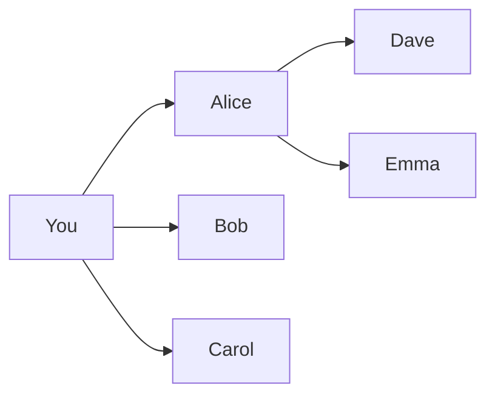
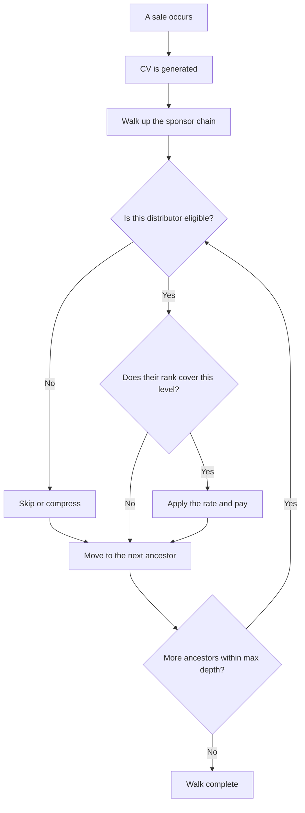
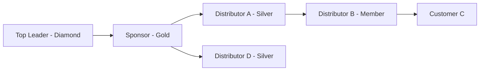

# Unilevel

Unilevel is the simplest compensation structure in MLM. It is also the most common. If you are designing your first plan, start here.

---

## What It Is

Every distributor can sponsor as many people as they want. There is no limit on how wide a single level can grow. This is the defining trait of unilevel. Width is unlimited.

Commissions flow upward through the sponsor chain, level by level. When someone makes a purchase, each person above them in the chain can earn a percentage of that sale. How far up depends on the plan's maximum depth and each distributor's rank.

The levels are counted from the perspective of each earner. Level 1 is your direct recruits. Level 2 is their recruits. Level 3 is one step further. And so on.

The diagram below shows a small unilevel tree with three levels.

You sponsored Alice, Bob, and Carol. They are your level 1. Alice then sponsored Dave and Emma. Dave and Emma are your level 2. Notice that you can sponsor as many people as you want on level 1. Alice can do the same on hers. There is no width restriction anywhere in the tree.

---

## How Earning Works

When someone buys a product, that purchase generates commissionable volume (CV). The system walks up the sponsor chain from the buyer, one level at a time, checking each ancestor. At each level, it asks two questions. Is this distributor eligible? And does their rank allow them to earn at this depth?

If the answer to both is yes, the distributor earns a commission. The formula is:

> CV x broad commission percent x volume-to-dollar multiplier x rank rate for that level

The **broad commission percent** is the base pool. It is the percentage of volume the company allocates to level commissions. Typical values are 30-50%. If a product generates 100 CV and the broad commission percent is 40%, then 40 CV worth of value is available for the level commission pool.

See [Fundamentals](fundamentals.md) for how eligibility works.

The diagram below shows the step-by-step flow when a sale happens.

The walk stops when it reaches the maximum depth or runs out of ancestors. Each level is evaluated independently. A distributor can earn on level 2 even if the person on level 1 was ineligible.

---

## Options You Have

These are the settings that shape how your unilevel plan behaves. Each one controls a different aspect of the payout math.

### Commission depth

**What it controls:** How many levels up from a sale the system walks to pay commissions.

**Choices:** Any number, typically 3 to 10.

**What it means:** A depth of 5 means up to 5 ancestors can earn from a single sale. A depth of 3 means only 3 can. Deeper plans are more expensive because more people get paid per sale. But deeper plans also give distributors a stronger reason to build deep organizations instead of just recruiting a wide frontline.

**Most common:** 5 to 7 levels.

### Broad commission percent

**What it controls:** The base percentage of volume allocated to the level commission pool.

**Choices:** Any percentage, typically 30-50%.

**What it means:** This is the slice of every sale that goes to level commissions before individual rates are applied. A 40% broad commission percent means 40% of CV feeds the pool. Higher values make your plan more attractive to distributors but leave less margin for the company and other bonus programs.

**Most common:** 40%.

### Rate table

**What it controls:** The commission rate each rank earns at each level.

**Choices:** A grid of percentages. Each rank has a row. Each level has a column.

**What it means:** Higher ranks typically earn at more levels and sometimes at higher rates. This is the primary way you reward advancement. A distributor at a lower rank sees a clear financial incentive to promote.

For example:
- A **Silver** earns 5% on level 1.
- A **Gold** earns 5% on levels 1-3.
- A **Diamond** earns 5% on levels 1-5 plus 3% on level 6.

The rate table is where you express the financial value of each rank. It is the single most important table in your compensation plan.

### Compression

**What it controls:** What happens when an inactive or low-rank distributor sits in the middle of the sponsor chain.

Without compression, an ineligible distributor still occupies their level. The people above them earn at a deeper level number because the ineligible person is taking up a slot. Commissions "leak" through empty layers.

There are three choices.

**No compression.** Everyone holds their level position regardless of eligibility. This is the simplest option. If level 3 is ineligible, level 4 stays at level 4. The levels above might push past the maximum depth and earn nothing. Simple to explain, but commissions leak through inactive layers.

**Skip inactive.** The system jumps over ineligible distributors during the upline walk. The next eligible person up earns at the skipped level instead. This means more commission dollars reach active builders. If three people in a row are inactive, all three are skipped and the person above them earns as if they were three levels closer to the sale.

**Skip below rank.** The system jumps over distributors who have not reached a certain rank. This concentrates earnings among proven leaders. It works like skip-inactive but the bar is higher. A distributor must hold a specific rank to hold their level position, not just be eligible.

**Most common:** Skip inactive.

### Australian X-Up (Pass-Up)

**What it controls:** Whether a distributor's first N recruits "pass up" their commissions to the distributor's sponsor.

**How it works:** Say the pass-up count is 2. When you sponsor your first two recruits, the commissions from those recruits go to your sponsor instead of you. Starting with recruit number 3, you earn directly. Your first two recruits build your sponsor's income. Your later recruits are fully yours.

You can also configure whether just the recruits themselves pass up, or whether the commissions from their entire downline also go to your sponsor. The second option is more aggressive but creates a stronger incentive for sponsors to support new distributors.

**The trade-off:** Early recruits do not earn you commissions. This can feel discouraging at first. But it creates a powerful dynamic. Your sponsor has a financial stake in helping you succeed because your first recruits pay them. And once you pass the threshold, every new recruit pays you directly with no sharing.

This option originated in Australian MLM companies. It is less common than standard unilevel but popular in certain markets.

**Most common:** Not used. Standard unilevel with no pass-up is the default.

---

## Worked Example

Here is a concrete example with real numbers. The tree has six people.

Top Leader is a Diamond. Sponsor is a Gold. Distributor A is a Silver. Distributor B is a Member. Distributor D is a Silver on a separate branch under Sponsor. Customer C buys from Distributor B.

Customer C buys a product worth **200 CV**. The broad commission percent is **40%**. The volume-to-dollar multiplier is **1.0**. No compression is in play. Everyone is eligible.

The rate table:

| Rank | Level 1 | Level 2 | Level 3 | Level 4 | Level 5 |
|------|---------|---------|---------|---------|---------|
| Member | 5% | -- | -- | -- | -- |
| Silver | 5% | 5% | -- | -- | -- |
| Gold | 5% | 5% | 5% | -- | -- |
| Diamond | 5% | 5% | 5% | 5% | 5% |

The system walks up from Customer C.

| Level from sale | Distributor | Rank | Rate | Calculation | Earnings |
|-----------------|-------------|------|------|-------------|----------|
| Level 1 | Distributor B | Member | 5% | 200 x 0.40 x 1.0 x 0.05 | $4.00 |
| Level 2 | Distributor A | Silver | 5% | 200 x 0.40 x 1.0 x 0.05 | $4.00 |
| Level 3 | Sponsor | Gold | 5% | 200 x 0.40 x 1.0 x 0.05 | $4.00 |
| Level 4 | Top Leader | Diamond | 5% | 200 x 0.40 x 1.0 x 0.05 | $4.00 |

Distributor B earns at level 1 because Customer C is directly below them. Distributor A earns at level 2. Sponsor earns at level 3. Top Leader earns at level 4. Each earns $4.00 from this sale.

Notice that Distributor B (a Member) can only earn on level 1. If Distributor B had someone buying below them, B would only earn on that one level. Sponsor (a Gold) earns up to level 3. Top Leader (a Diamond) earns up to level 5.

Distributor D sits on a separate branch. No sale happened in D's downline this period, so no commissions fire from that branch. D is part of the tree but earns nothing until volume flows through their line.

---

## What It Doesn't Do

Unilevel is powerful in its simplicity. But it has clear boundaries.

**No leg balancing.** There is no requirement to build evenly across two or more legs. That mechanic belongs to binary plans. In unilevel, you can put everyone under one frontline recruit and the math still works.

**No fixed width limits.** There is no cap on how many people one distributor can sponsor. If someone recruits 50 people on their frontline, that is fine. Fixed width limits are a matrix feature.

**No breakaway mechanics.** Groups do not detach when a distributor reaches a certain rank. That is how stairstep breakaway plans work. In unilevel, your downline stays your downline regardless of rank.

**No way to restrict sponsoring.** You cannot configure the plan to limit how many people one distributor can recruit. The unlimited width is baked into the structure. If you need width constraints, use a matrix or binary plan instead.
